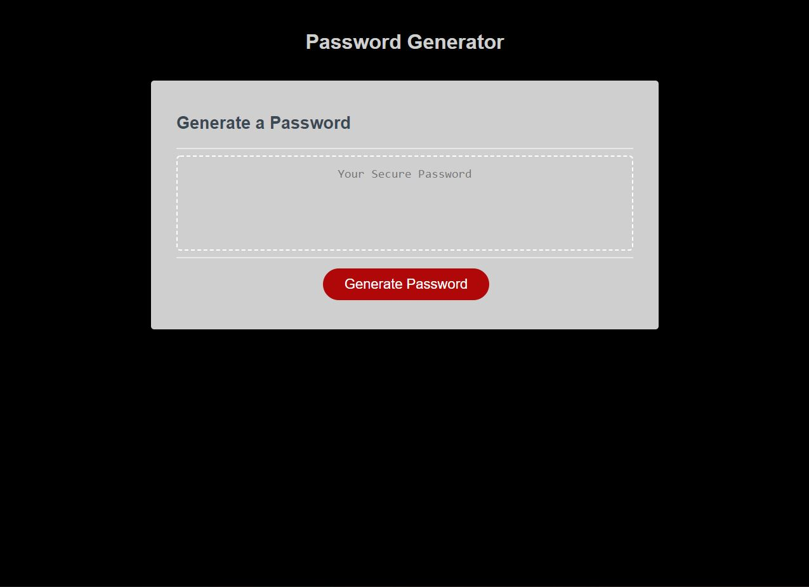

<a href="https://ethanrmcdowell.github.io/Password-Generator/">Link to password generator website</a>

The purpose of this project was to work with existing HTML and CSS to create a working password generator. The generator is to ask for user inputs in regards to password length (between 8 and 128 characters) and which type of characters are to be used. If the password length is insufficient, an error window will pop up and the page will reload. When it's entered correctly and the prompts are answered, it loads an array with all of the characters requested to be in the password, picks randomly among the chosen characters, and will then display the password where "Your Secure Password" was previously written.

I also added a restart button if you'd like to run the generator again. This runs a quick page reload function so you can try again.